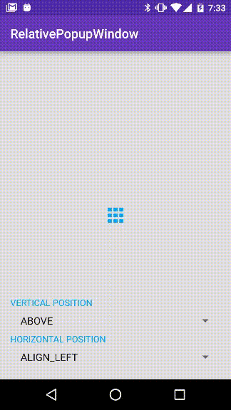

# RelativePopupWindow

[](http://developer.android.com/index.html)

[](https://android-arsenal.com/api?level=9)
[](https://android-arsenal.com/details/1/3908)

Android PopupWindow that can be easily located relative to anchor View.



## Usage

Extend [RelativePopupWindow](relativepopupwindow/src/main/java/com/labo/kaji/relativepopupwindow/RelativePopupWindow.java) class and call showOnAnchor().

```java
popup.showOnAnchor(anchor, VerticalPosition.ABOVE, HorizontalPosition.CENTER);
```

See detail example in [ExampleCardPopup.kt](example/src/main/kotlin/com/labo/kaji/relativepopupwindow/example/ExampleCardPopup.kt)
or in Java, [ExampleCardPopup.java](example/src/main/java/com/labo/kaji/relativepopupwindow/example/java/ExampleCardPopup.java).

## Position Parameters

### VerticalPosition

- ABOVE
- ALIGN_BOTTOM
- CENTER
- ALIGN_TOP
- BELOW

### HorizontalPosition

- LEFT
- ALIGN_RIGHT
- CENTER
- ALIGN_LEFT
- RIGHT

## Install

This library is available in jcenter.

```groovy
compile 'com.labo.kaji:relativepopupwindow:0.2.0'
```

## License

MIT License.
